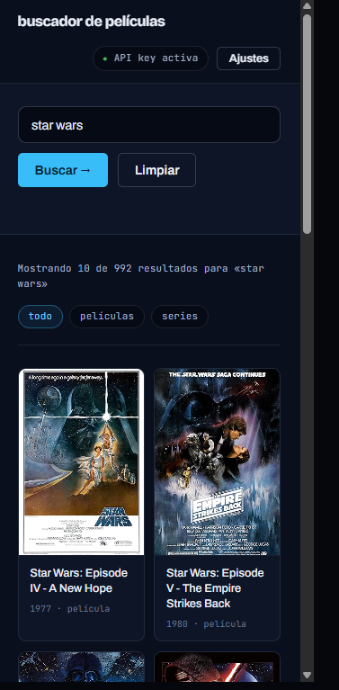

# 🍿 Buscador de películas

Aplicación web de una sola página para buscar películas y series usando la API
pública de [OMDb](https://www.omdbapi.com/). Escribe un título y los resultados
aparecen solos en una cuadrícula responsive, con búsqueda automática mientras
escribes (debounce), validación del formulario y estados de carga y error
diferenciados.

Proyecto realizado como práctica de React (DAW).

## ✨ Características

- Búsqueda por título contra la API de OMDb.
- **Búsqueda automática con debounce de 300 ms**: no se lanza una petición por
  cada tecla, solo cuando dejas de escribir.
- Envío manual del formulario que convive con la búsqueda automática.
- **Validaciones**: no se permite búsqueda vacía, ni que empiece por espacio, ni
  con menos de 3 caracteres. El mensaje aparece bajo el input sin bloquear el
  formulario.
- **Cuatro estados visuales** diferenciados: inicial, cargando, error de red o de
  API, y "no se han encontrado resultados".
- No se repite dos veces seguidas la misma búsqueda.
- Placeholder para las películas que no tienen póster (`"Poster": "N/A"`).
- Cuadrícula responsive con CSS Grid, tema oscuro, sin frameworks de CSS.

## 📸 Capturas

<!-- Haz las capturas, guárdalas en una carpeta /screenshots y descomenta: -->

<!--  -->

_Estado inicial_

<!--  -->

_Resultados de una búsqueda_

<!--  -->

_Mensaje de validación_

<!--  -->

_Vista en móvil_

## 🛠️ Stack

| Tecnología | Uso |
|---|---|
| [React](https://react.dev/) | Interfaz y gestión de estado con hooks |
| [Vite](https://vite.dev/) | Servidor de desarrollo y empaquetado |
| JavaScript (ES Modules) | Sin TypeScript |
| CSS plano | Sin Tailwind ni librerías de componentes |
| [OMDb API](https://www.omdbapi.com/) | Origen de los datos |
| [Oxlint](https://oxc.rs/) | Linter |

**Sin librerías de estado** (nada de Redux ni Zustand) y **sin React Router**:
todo se resuelve con `useState`, `useEffect`, `useRef` y `useCallback`.

## 📁 Estructura del proyecto

```
src/
├── components/
│   ├── SearchForm.jsx   # Formulario: input controlado + botón
│   └── Movies.jsx       # Cuadrícula de películas + tarjeta individual
├── hooks/
│   ├── useMovies.js     # Pide las películas al servicio y las mapea
│   └── useSearch.js     # Estado del input y su validación
├── services/
│   └── movies.js        # ÚNICO sitio donde se hace fetch a OMDb
├── App.jsx              # Une los hooks, el debounce y los estados visuales
├── App.css              # Estilos de la aplicación
└── index.css            # Reset y variables del tema
```

### Regla de arquitectura

```
Componente  →  Hook  →  Service  →  API
```

Ningún componente hace `fetch` directamente. El componente llama al hook, el
hook llama al service y solo el service habla con OMDb. Además, el hook
**mapea** la respuesta a un objeto propio con las claves en minúscula:

```js
// Lo que devuelve OMDb        ->  Lo que usa nuestra app
{ imdbID, Title, Year, Poster } -> { id, title, year, poster }
```

Así, si algún día se cambia de API, solo hay que tocar `services/movies.js` y la
función de mapeo: los componentes no se enteran.

## 🚀 Instalación

Necesitas [Node.js](https://nodejs.org/) 18 o superior.

```bash
# 1. Clonar el repositorio
git clone https://github.com/IvanChesa/buscador-peliculas.git
cd buscador-peliculas

# 2. Instalar dependencias
npm install
```

## 🔑 Configurar la variable de entorno

La aplicación no funciona sin una API key de OMDb.

1. Consigue una gratis en <https://www.omdbapi.com/apikey.aspx> (plan **FREE**,
   1000 peticiones al día). Te llegará por correo y tendrás que **activarla**
   pulsando el enlace del email.

2. Crea el archivo `.env.local` en la raíz del proyecto copiando el ejemplo:

   ```bash
   # PowerShell (Windows)
   Copy-Item .env.example .env.local
   ```

   ```bash
   # Bash (macOS / Linux)
   cp .env.example .env.local
   ```

3. Abre `.env.local` y pega tu clave:

   ```
   VITE_OMDB_API_KEY=tu_api_key_aqui
   ```

> ⚠️ **Importante:** el prefijo `VITE_` es obligatorio. Vite solo expone al
> navegador las variables que lo llevan. Y tras crear o modificar `.env.local`
> hay que **reiniciar el servidor de desarrollo** (`Ctrl + C` y `npm run dev`):
> Vite lee las variables al arrancar, no en caliente.

`.env.local` está en el `.gitignore`, así que tu clave nunca se sube al
repositorio.

## ▶️ Ejecutar

```bash
npm run dev       # servidor de desarrollo en http://localhost:5173
npm run build     # build de producción en /dist
npm run preview   # sirve el build de producción para probarlo
npm run lint      # pasa el linter
```

## 🔒 Nota de seguridad sobre la API key

**En una aplicación 100 % frontend, la API key queda expuesta.**

Aunque la clave esté en un archivo `.env.local` que no se sube a GitHub, Vite la
**sustituye literalmente por su valor** al hacer el build. El resultado es que
la clave acaba escrita en texto plano dentro de los archivos JavaScript que se
descarga el navegador. Cualquiera puede verla abriendo las DevTools, mirando la
pestaña *Network* o leyendo el bundle en `/dist`.

Es decir: **`.env.local` protege la clave de tu repositorio, no de tus
usuarios.**

Para este proyecto es asumible porque la clave de OMDb es gratuita, de uso
personal y limitada a 1000 peticiones diarias. Pero en una aplicación real, y
sobre todo con claves de pago, la solución correcta es meter un **backend por
delante**:

```
Navegador  →  Tu servidor (guarda la clave)  →  API externa
```

El navegador llama a tu propio servidor, y es ese servidor —donde la variable de
entorno sí es privada— quien añade la clave y llama a la API externa. Se puede
hacer con Node/Express, con serverless functions (Vercel, Netlify) o con el
backend que uses. La regla general: **si una clave llega al navegador, hay que
considerarla pública.**

## 📄 Licencia

Proyecto educativo de uso libre. Los datos de las películas pertenecen a
[OMDb API](https://www.omdbapi.com/).
